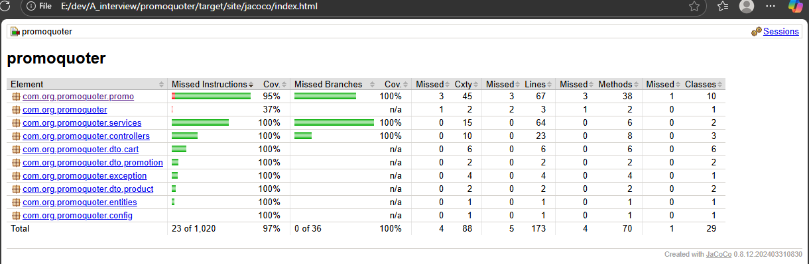

# PromoQuoter - Cart Pricing & Reservation Microservice
Spring Boot 3.x REST service that calculates cart prices using pluggable, ordered promotion rules and reserves inventory on confirmation with idempotency.

## Features
### Products :

- POST /products (bulk create)
- GET /products (verify inventory state, after attempt to double reservations)

### Promotions (pluggable + composable):
- categories(PERCENT_OFF_CATEGORY,BUY_X_GET_Y, ... )
- POST /promotions (bulk create promotions)

### Cart:
- POST /cart/quote — itemized quote with - applied promotions (in order)
- POST /cart/confirm — atomic stock validation + reservation; supports Idempotency-Key

### Concurrency & correctness:
- Optimistic/pessimistic locking
- No negative prices; proper rounding (HALF_UP)

### Observability:
- Swagger UI for interactive testing
- H2 in-memory DB (default)

## Quickstart
### 1) Prerequisites
Java 17+
Maven 3.9+
ports `9903` and `8080` should be open in your in the test environment.

### 2) Build
```bash
 # Using local Maven
mvn -q clean verify

# Or with Maven Wrapper (recommended for CI reproducibility)
./mvnw -q clean verify        # macOS/Linux
mvnw.cmd -q clean verify      # Windows
```

### 3) Run the app
```bash
mvn spring-boot:run
# or
./mvnw spring-boot:run
```
App starts on `http://localhost:9003`.

## API — Quick Tests
### Swagger / OpenAPI
- Open Swagger UI: `http://localhost:9003/swagger-ui/index.html`

Use Swagger UI to try all endpoints without crafting curl by hand.
cURL tests (alternatively you can convert to powershell scripts)

Create products:
```bash
  curl -X POST http://localhost:9003/products \
  -H "Content-Type: application/json" \
  -d '{
        "products": [
          { "name": "Laptop", "category": "ELECTRONICS", "price": 1200.50, "stock": 5 },
          { "name": "Shirt",  "category": "CLOTHING",    "price": 50.00,   "stock": 20 }
        ]
      }'
```
List products (to verify inventory):
`curl http://localhost:9003/products`

Create promotions
```bash
 curl -X POST http://localhost:9003/promotions \
  -H "Content-Type: application/json" \
  -d '{
        "promotions": [
          { "type": "PERCENT_OFF_CATEGORY", "name": "Electronics 10%", "priority": 1, "enabled": true, "category": "ELECTRONICS", "percent": 10 },
          { "type": "BUY_X_GET_Y", "name": "Buy2Get1 Shirt", "priority": 2, "enabled": true, "productId": 2, "buyQty": 2, "freeQty": 1 }
        ]
      }'
```

Quote cart:
```bash
 curl -X POST http://localhost:9003/cart/quote \
  -H "Content-Type: application/json" \
  -d '{
        "items": [
          { "productId": 1, "qty": 1 },
          { "productId": 2, "qty": 3 }
        ],
        "customerSegment": "REGULAR"
      }'
```

Confirm cart (idempotent):
```bash
curl -X POST http://localhost:9003/cart/confirm \
  -H "Content-Type: application/json" \
  -H "Idempotency-Key: 123e4567-e89b-12d3-a456-426614174000" \
  -d '{
        "items": [
          { "productId": 1, "qty": 1 },
          { "productId": 2, "qty": 3 }
        ],
        "customerSegment": "REGULAR"
      }'
```

### Testing — Unit and Integration testing.
```bash
  mvn -q clean verify
    # or
  ./mvnw -q clean verify
```

### Test coverage (JaCoCo)
```bash
mvn -q clean test
# Report:
# target/site/jacoco/index.html
```

## Package (skip tests when you just need the jar)
`mvn -q -DskipTests package `

## Assumptions
- Promotion execution order is defined by priority ascending.
- Idempotency applies to /cart/confirm only.
- In-memory H2 is used for demo; swap to RDBMS by changing datasource properties.

## Troubleshooting
- 409 CONFLICT on confirm: stock exhausted or concurrent reservation.
- Idempotency: Re-using the same Idempotency-Key for the same payload should not double-reserve.

### Improvements need before deploying to prod
- adding Oauth2/JWT security tokens.
- plugging in flyway/liquibase for data migration.
- add Jasypt to encript passwords & other sensitive info.
- dockerize and containerize.

Generated test report
